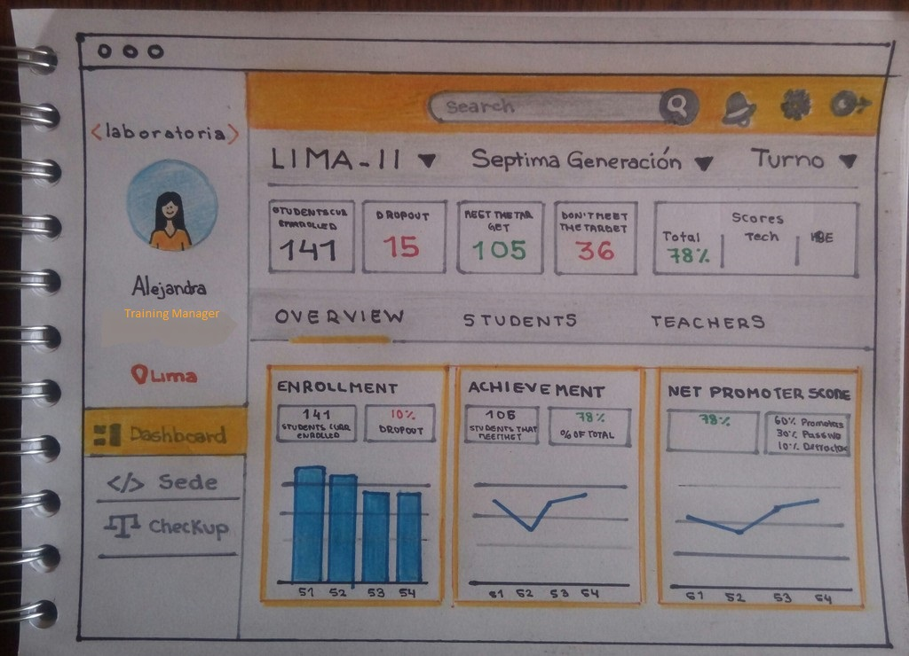

# Sketching

**Curso: Creando un sitio web interactivo con JavaScript**  

**Unidad: Intro a User Experience Design**

***

## El reto es:

Crea un sketch para la herramienta del dashboard de Laboratoria

El dashboard es una herramienta utilizada por profesores, training managers, directores y gerentes de Laboratoria para ver rápidamente qué está pasando en el salón de clases de Laboratoria. En el dashboard, los usuarios mencionados pueden ver rápidamente estadísticas y datos en tiempo real como:

* de alumnas inscritas

* de alumnas que desertaron

* y % de alumnas que pasan el criterio mínimo de evaluación

* Promedio de notas por sprint

* Promedio de notas HSE

* Promedio de notas técnicas

Además, dado que Laboratoria tiene muchas generaciones, regularmente 2 * generaciones por año (estas generaciones empezaron en el 2014), y que opera en 4 sedes (Arequipa, Ciudad de México, Lima y Santiago de Chile), es posible que los usuarios quieran ver datos de sedes / generaciones anteriores para poder hacer comparaciones.

## Proceso

* Mi squad y yo, fuimos a entrevistar a Ale, nuestra Training Manager, para poder saber qué tipo de gráficos le facilitaba leer la información y otras cosas más.

* Luego, hice mi primer boceto, el cual rehice para que sea mi primer Sketching.

* Le mostré a Ale mi Sketching del Dashboard, me dió un buen feedback y modifiqué algunas cosas.

## Sketching 

### Login

#### Explicando elementos

* En la parte superior central se visualiza el nombre de la web, que en este caso sería "Dashboard" "Laboratoria". 

* Las casillas de USER y KEY son redondeadas y de color gris porque ese es el estilo de Laboratoria. 

* En la casilla KEY puse una opción de poder ver la clave cuando la estás escribiendo. Así evitamos escribirla mal y perder tiempo volviendo a teclear.

* El botón de SIGN IN obviamente, tenía que ser más resaltante y con el color característico de Laboratoria.

* En la parte final de nuestra ventana, hay un pequeño enlace: "crear una cuenta", para aquel usuario que aún no esté registrado.

### Dashboard

* La estructura está definida muy parecida a la estructura utilizada en LMS Laboratoria, para que el usuario sienta que está dentro de un producto de Laboratoria rápidamente.

* Al lado izquierdo tenemos tenemos el menú principal. Es permanente. Primero está el logo de Laboratoria. 
Cuando entrevistamos a nuestra Jedi y Training Manager Ale, nos dijo que le gustaría ver su foto, sentirse identificada. Por eso, coloqué una imagen, su nickname y su cargo. 
Luego, viene la ubicación en la que ella se encuentra, según esa información se carga la ventana principal del Dashboard.
Después vienen las opciones "Dashboard", "Sede" y "Checkup". Como mencionaba antes, la opción "Dashboard" se carga por default cuando recién ingresamos y su contenido es definido por la ubicación del usuario. Ale, también mencionó que le gustaría poder acceder a la información de otras sedes, para eso existe la opción "Sede". 
En el reto se menciona que colocaramos una opción de "comparación" en la que se pudiera filtrar y comparar información. Por eso aparece la opción "Checkup", con ese nombre porque "Comparation" u otros nombres, sonoban un poco mal.

* En la parte superior hay una barra menú. La cual tiene una opción de Search para que el usuario busque información exacta. 
Un ícono de campana para que avisar de alguna deserción o cambio brusco de porcentajes, etc. También una tuerca que es la configuración y Ayuda. Finalmente la opción de salida.

* En la ventana principal tenemos el título "LIMA-II" con una flecha hacia abajo, la cual despliega opciones para filtrar los sprints dentro de Lima. 
Al lado vemos "Septima Generación" igualmente con una flecha hacia abajo, esta sirve para filtrar qué generación queremos visualizar. Luego viene turno, esta opción solo estaría activa para la septima generación y filtraría "Turno AM" y "Turno PM".
Debajo hay una barra que muestra la inforación principal como: cuántas alumnas se inscribieron, cuántas han desertado, cuántas alumnas alcanzaron la meta, cuántas alumnas no alcanzaron la meta y el resultado de la clase(total, tech y HSE). Decidí esto, basándome en que Ale mencionó que le es importante ver números y porcentajes.
Después, una barra de navegación faceteada de opciones "Overview" para visualizar toda la data en gráficos y porcentajes de la clase completa y también de los profesores; "Students" para poder conocer a las alumnas dentro de clase; y "Teachers" para conocer a los profesores dentro de esa clase.

* A continuación siguen los gráficos. Estos también estpan definidos por "Incripción", "Logro" y "Puntaje neto del promotor". (Estos los saqué del diseño ejemplo de laboratoria). Decidí usar los gráficos de "uve" porque Ale también quería ver eso. 

